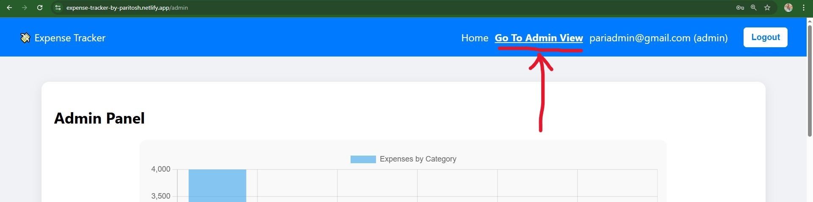
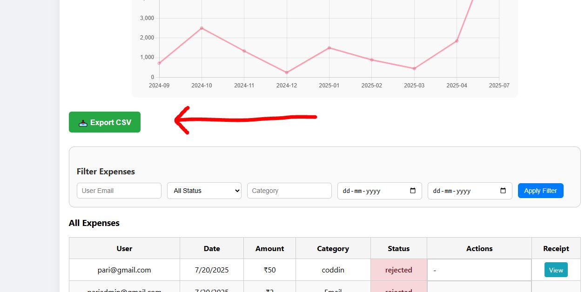
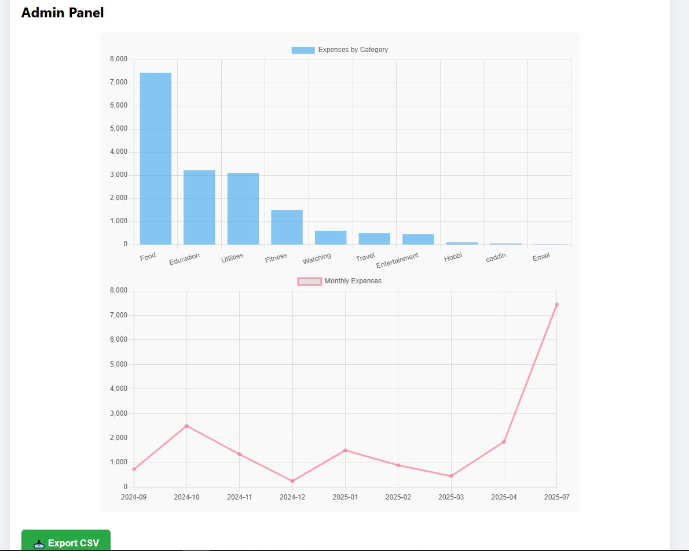

# 💼 Fullstack Expense Tracker

A full-stack web application built for Pocketrocket Labs as part of the Fullstack Engineer internship assignment. This app helps remote teams track and review expenses with authentication, role-based access control, chart-based analytics, audit logging, and more.

---

## 🌐 Live Links

- 🔗 **Frontend**: [https://expense-tracker-by-paritosh.netlify.app/admin](https://expense-tracker-by-paritosh.netlify.app/admin)
- 🔗 **Backend**: [https://expense-ttracker.onrender.com/](https://expense-ttracker.onrender.com/)
- 🛠 **GitHub Repository**: [Expense Tracker Repo](https://github.com/ParitoshBarman/Expense-Ttracker)
  - [📄 Backend Documentation](https://github.com/ParitoshBarman/Expense-Ttracker/tree/master/backend)
  - [📄 Frontend Documentation](https://github.com/ParitoshBarman/Expense-Ttracker/tree/master/frontend)

---

## 🔐 Test Credentials

### 👤 Employee:
- **Email**: `pari@gmail.com`
- **Password**: `123`

### 🛡️ Admin:
- **Email**: `pariadmin@gmail.com`
- **Password**: `123`

---

## 🚀 Core Features

### 1. Authentication & RBAC
- ✅ Secure email/password authentication
- ✅ JWT-based login sessions
- ✅ Role-based access: `employee`, `admin`

### 2. Expense Tracking
- ✅ Employees can add/view expenses (amount, category, date, notes)
- ✅ Admins can view, filter, and update expense status (`pending`, `approved`, `rejected`)

### 3. Charts & Insights (Admin-only)
- ✅ Total expenses per category (Bar Chart)
- ✅ Expenses over time by month (Line Chart)

### 4. Audit Logs
- ✅ Track actions like expense creation and status updates
- ✅ Display logs in a dedicated admin-only page

### 5. Bonus Features 🎁
- ✅ CSV export for admin reports
- ✅ File upload support for receipts (Multer)
- ✅ Responsive and clean UI
- ✅ Fully deployed (Render for backend, Netlify for frontend)

---

## 🛠 Tech Stack

### Backend
- Node.js + Express.js
- MongoDB + Mongoose
- Multer (file uploads)
- JWT for Auth
- json2csv (CSV export)
- Deployed on Render

### Frontend
- React.js + Vite
- React Router
- Chart.js for visual analytics
- Axios for API communication
- Deployed on Netlify

---

## 📁 Folder Structure

```
Expense Ttracker
├── README.md
├── backend
│   ├── Expense Ttracker.postman_collection.json
│   ├── README.md
│   ├── config
│   │   └── db.js
│   ├── controllers
│   │   ├── analyticsController.js
│   │   ├── auditLogController.js
│   │   ├── authController.js
│   │   └── expenseController.js
│   ├── index.js
│   ├── middlewares
│   │   ├── authMiddleware.js
│   │   ├── roleMiddleware.js
│   │   └── uploadMiddleware.js
│   ├── models
│   │   ├── AuditLog.js
│   │   ├── Expense.js
│   │   └── User.js
│   ├── package-lock.json
│   ├── package.json
│   ├── routes
│   │   ├── analyticsRoutes.js
│   │   ├── auditRoutes.js
│   │   ├── authRoutes.js
│   │   └── expenseRoutes.js
│   └── uploads
│       ├── 1752935547307-258627805.pdf
│       ├── 1752935906732-375208961.pdf
│       ├── receipt1752936045170-123693.pdf
│       ├── receipt_1752936071530-102375674.pdf
│       ├── receipt_1752936263371-79365226.pdf
│       └── receipt_1752995485880-396633970.csv
└── frontend
    ├── README.md
    ├── eslint.config.js
    ├── index.html
    ├── package-lock.json
    ├── package.json
    ├── public
    │   ├── _redirects
    │   └── vite.svg
    ├── src
    │   ├── App.css
    │   ├── App.jsx
    │   ├── api
    │   │   └── axios.js
    │   ├── assets
    │   │   └── react.svg
    │   ├── auth
    │   │   ├── AuthContext.jsx
    │   │   └── RoleGuard.jsx
    │   ├── components
    │   │   ├── Navbar.jsx
    │   │   └── RoleBased.jsx
    │   ├── index.css
    │   ├── main.jsx
    │   ├── pages
    │   │   ├── AdminPanel.jsx
    │   │   ├── Dashboard.jsx
    │   │   ├── Login.jsx
    │   │   └── Register.jsx
    │   └── routes
    │       └── Routes.jsx
    └── vite.config.js
```

---

## ⚙️ Setup Instructions

### 🖥️ Backend

```bash
git clone https://github.com/ParitoshBarman/Expense-Ttracker.git
cd Expense-Ttracker/backend
npm install
# Create a .env file with:
# PORT=5000
# MONGO_URI=mongodb://localhost:27017/expense-tracker
# JWT_SECRET=your_secret_key
npm start
```

### 🌐 Frontend

```bash
cd ../frontend
npm install
# Create a .env file with:
# VITE_API_BASE_URL=https://expense-ttracker.onrender.com/api
npm run dev
```

---

## 📸 Screenshots

| Login Page | Register Page |
|------------|----------------|
|  |  |

| Employee Navbar | Admin Navbar |
|------------------|---------------|
|  |  |

| Employee Dashboard | Employee Expense Table |
|--------------------|------------------------|
|  |  |

| Admin All Expenses Table | CSV Export Button |
|---------------------------|------------------|
|  |  |

| Expense Insights (Admin) | Audit Logs (Admin) |
|--------------------------|--------------------|
|  |  |


---


## ✍️ Author

**👨‍💻 Paritosh Barman**
- GitHub: [@ParitoshBarman](https://github.com/ParitoshBarman)
